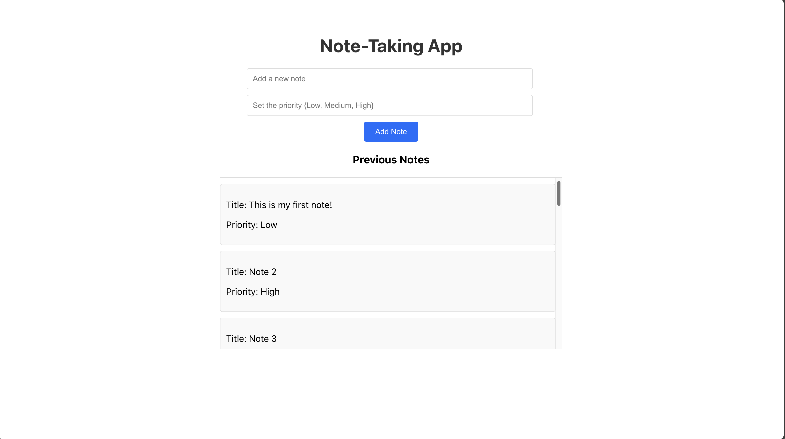

# React with Express

This is the code you asked for to connect a React app to an Express server.
I am extending the project we created during the second workshop.
I tried to make it as simple as possible without relying to third-party libraries and also handle some edge cases.

## How it looks

## Start the development server

1. You need to start the MongoDB server locally using the following command: `mongod --dbpath=data` (make sure MongoDB is installed and data directory exists).
2. Go to the `express` directory and run the following command to installing the dependencies: `npm install`
3. Run the express server using the following command: `npm start`
4. Go to the `react` directory and run the following command to installing the dependencies: `npm install`
5. Run the react app using the following command: `npm start`
6. It should open a page automatically in your default browser.

That's it.
